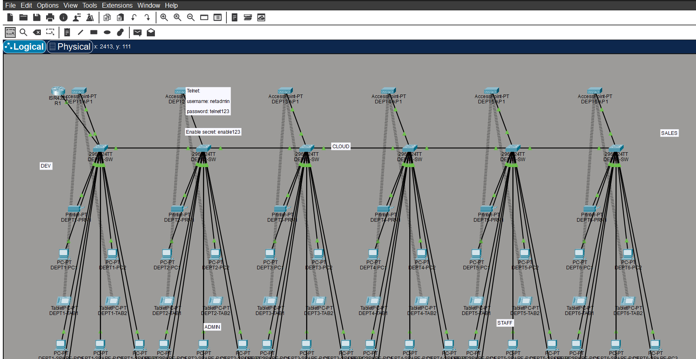

# packet-tracer-skill

Cisco Packet Tracer 9.x `.pkt` generator and editor for skill-based coding hosts.

Bu repository skill əsaslı coding host-lar üçün Cisco Packet Tracer 9.x `.pkt`
generatoru və editorudur.

---

## English

### Overview

This repository is built for one specific job: take a natural-language network
request, plan it explicitly, adapt a compatible local Cisco Packet Tracer donor
lab, and produce a `.pkt` file that opens cleanly in Packet Tracer 9.x.

Design defaults:

- Cisco local samples are the primary donor source
- external labs are reference-only
- prompt parsing happens before generation
- generation uses donor-prune adaptation for compatibility
- unsafe requests return `blocking_gaps` instead of guessed output

### Host Support

Use the same repository, then install it into the skill path your host expects.

| Tool | Install | First Use |
| --- | --- | --- |
| Claude Code | `npx github:20hajiyev/packet-tracer-skill --claude` | `Use /pkt to build a Packet Tracer lab with VLAN and DHCP` |
| Cursor | `npx github:20hajiyev/packet-tracer-skill --cursor` | `@pkt build a Packet Tracer lab with VLAN and DHCP` |
| Gemini CLI | `npx github:20hajiyev/packet-tracer-skill --path <gemini-skills-dir>` | `Use pkt to build a Packet Tracer lab with VLAN and DHCP` |
| Codex CLI | `npx github:20hajiyev/packet-tracer-skill` | `Use pkt to build a Packet Tracer lab with VLAN and DHCP` |
| Antigravity | `npx github:20hajiyev/packet-tracer-skill --path <antigravity-skills-dir>` | `Use @pkt to build a Packet Tracer lab with VLAN and DHCP` |
| Kiro CLI | `npx github:20hajiyev/packet-tracer-skill --kiro` | `Use pkt to build a Packet Tracer lab with VLAN and DHCP` |
| Kiro IDE | `npx github:20hajiyev/packet-tracer-skill --kiro` | `Use @pkt to build a Packet Tracer lab with VLAN and DHCP` |
| GitHub Copilot | Copy this repo into your local prompts/rules/skills docs | `Ask Copilot to use pkt to build a Packet Tracer lab with VLAN and DHCP` |
| OpenCode | `npx github:20hajiyev/packet-tracer-skill --path .agents/skills` | `opencode run @pkt build a Packet Tracer lab with VLAN and DHCP` |
| AdaL CLI | `npx github:20hajiyev/packet-tracer-skill --adal` | `Use pkt to build a Packet Tracer lab with VLAN and DHCP` |
| Custom path | `npx github:20hajiyev/packet-tracer-skill --path ./my-skills` | Depends on your tool |

### Quick Start

Default install for Codex:

```powershell
npx github:20hajiyev/packet-tracer-skill
```

Common targets:

```powershell
npx github:20hajiyev/packet-tracer-skill --cursor
npx github:20hajiyev/packet-tracer-skill --claude
npx github:20hajiyev/packet-tracer-skill --kiro
```

If you publish this package to npm later, the same commands become:

```powershell
npx packet-tracer-skill
npx packet-tracer-skill --cursor
```

If PowerShell blocks `npx.ps1`, use:

```powershell
cmd /c npx github:20hajiyev/packet-tracer-skill --cursor
```

If you want the local development setup instead:

```powershell
git clone https://github.com/20hajiyev/packet-tracer-skill.git
cd .\packet-tracer-skill
powershell -ExecutionPolicy Bypass -File .\scripts\setup.ps1 -Dev
```

### Verify the Install

Check that the skill was installed into the expected target path:

```powershell
npx github:20hajiyev/packet-tracer-skill --verify
npx github:20hajiyev/packet-tracer-skill --verify --cursor
npx github:20hajiyev/packet-tracer-skill --verify --path .agents/skills
```

From a local clone:

```powershell
node .\bin\packet-tracer-skill.js --verify
python .\scripts\install_skill.py --host codex --force
```

### Runtime Configuration

Set the local Packet Tracer environment before real `.pkt` generation:

```powershell
$env:PACKET_TRACER_ROOT='C:\Program Files\Cisco Packet Tracer 9.0.0'
$env:PACKET_TRACER_COMPAT_DONOR='C:\labs\campus_donor_9_0.pkt'
$env:PKT_TWOFISH_LIBRARY='C:\tools\pkt-twofish\_twofish.cp314-win_amd64.pyd'
```

Important variables:

- `PACKET_TRACER_ROOT`
- `PACKET_TRACER_SAVES_ROOT`
- `PACKET_TRACER_EXE`
- `PACKET_TRACER_COMPAT_DONOR`
- `PACKET_TRACER_TARGET_VERSION`
- `PKT_TWOFISH_LIBRARY`

### What This Repo Does

- Parses hybrid Azerbaijani + English prompts
- Builds explicit `IntentPlan`, `TopologyPlan`, and `ConfigPlan`
- Ranks Cisco local donors by capability and topology fit
- Uses donor-prune adaptation for Packet Tracer 9.x compatibility
- Edits existing `.pkt` labs
- Supports VLAN, router-on-a-stick, DHCP, DNS, Telnet, ACL, wireless/AP-client, and department/campus layouts
- Explains the plan before generation with `--explain-plan`

### Explain-Plan Output

`--explain-plan` reports:

- `intent_plan`
- `topology_plan`
- `config_plan`
- `estimate_plan`
- `preflight_validation`
- `autofix_summary`
- `validation_report`
- `cisco_sample_candidates`
- `external_reference_patterns`
- `assumptions_used`

This is the main debugging surface for prompt quality.

### External Reference Workflow

External `.pkt` collections must be local first. This tool does not scrape the
internet and does not use GitHub URLs directly as donors.

Workflow:

1. clone or copy the external repo locally
2. pass that folder with `--reference-root`
3. inspect `external_reference_patterns` in `--explain-plan`

Example:

```powershell
python .\scripts\generate_pkt.py --explain-plan "6 şöbəli şəbəkə qur, hər şöbədə 1 switch 1 AP 1 printer 2 PC 2 tablet olsun" --reference-root C:\labs\external-pkt-samples
```

### Common Commands

Build the Cisco sample catalog:

```powershell
python .\scripts\build_sample_catalog.py
```

Explain a simple prompt:

```powershell
python .\scripts\generate_pkt.py --explain-plan "3 dene switch ve 6 komputer"
```

Explain a donor-prune campus prompt:

```powershell
python .\scripts\generate_pkt.py --explain-plan "6 şöbəli şəbəkə qur, hər şöbədə 1 switch, 1 AP, 1 printer, 2 PC, 2 tablet olsun, router-on-a-stick olsun, DHCP routerdən verilsin, management VLAN və telnet olsun"
```

Generate a `.pkt`:

```powershell
python .\scripts\generate_pkt.py --prompt "6 şöbəli şəbəkə qur, hər şöbədə 1 switch, 1 AP, 1 printer, 2 PC, 2 tablet olsun, router-on-a-stick olsun, DHCP routerdən verilsin, management VLAN və telnet olsun" --output .\output\campus.pkt --xml-out .\output\campus.xml
```

Inspect an existing `.pkt`:

```powershell
python .\scripts\generate_pkt.py --inventory .\input\lab.pkt
```

Decode a `.pkt`:

```powershell
python .\scripts\generate_pkt.py --decode .\output\campus.pkt --xml-out .\output\campus.xml
```

### Requirements

- Windows
- Cisco Packet Tracer 9.x installed locally
- local Cisco Packet Tracer sample saves
- a local Packet Tracer 9.x donor lab
- a local Twofish bridge compatible with your Python runtime

Python setup:

```powershell
powershell -ExecutionPolicy Bypass -File .\scripts\setup.ps1 -Dev
```

### Twofish Bridge

This public repo does not ship a prebuilt Twofish bridge binary by default.

That is intentional:

- no machine-specific binary is committed by default
- no unsigned local artifact is published by accident
- no private path or build residue is shared by default

Read `scripts/vendor/README.md` for local setup.

### Screenshot

Generated campus topology opened in Cisco Packet Tracer:



### Security and Privacy

This repo is prepared to avoid accidental sharing of local private material:

- no hardcoded donor path is committed
- no `C:\Users\<name>\...` donor path is baked into config
- generated `.pkt` and `.xml` files are gitignored
- Python cache files are gitignored
- Twofish bridge binaries are gitignored

Before publishing:

- verify your own `PACKET_TRACER_COMPAT_DONOR` path is local-only
- do not commit generated labs unless you intend to share them
- do not commit locally built bridge binaries unless you reviewed them

### Current Limitations

- Packet Tracer 9.x only
- Windows-first workflow
- donor-prune generation is bounded by donor capacity
- external labs are not donors by default
- bundled template coverage is intentionally limited

### License

This project is licensed under the MIT License.

---

## Azərbaycan dili

### Ümumi baxış

Bu repository bir konkret iş üçün qurulub: təbii dildə yazılmış şəbəkə
istəyini başa düşmək, onu açıq plan şəklinə salmaq, lokal Cisco Packet Tracer
donor labını uyğunlaşdırmaq və Packet Tracer 9.x-də açılan `.pkt` faylı
yaratmaq.

Əsas prinsiplər:

- Cisco-nun lokal sample-ları əsas donor mənbəyidir
- xarici lab-lar yalnız reference kimi istifadə olunur
- prompt əvvəl parse olunur, sonra generate edilir
- uyğunluq üçün donor-prune yanaşması istifadə olunur
- natamam istəklər üçün uydurma nəticə yox, `blocking_gaps` qaytarılır

### Host dəstəyi

Eyni repository istifadə olunur, sadəcə host-un gözlədiyi skill yoluna
quraşdırılır.

| Alət | Quraşdırma | İlk istifadə |
| --- | --- | --- |
| Claude Code | `npx github:20hajiyev/packet-tracer-skill --claude` | `Use /pkt to build a Packet Tracer lab with VLAN and DHCP` |
| Cursor | `npx github:20hajiyev/packet-tracer-skill --cursor` | `@pkt build a Packet Tracer lab with VLAN and DHCP` |
| Gemini CLI | `npx github:20hajiyev/packet-tracer-skill --path <gemini-skills-dir>` | `Use pkt to build a Packet Tracer lab with VLAN and DHCP` |
| Codex CLI | `npx github:20hajiyev/packet-tracer-skill` | `Use pkt to build a Packet Tracer lab with VLAN and DHCP` |
| Antigravity | `npx github:20hajiyev/packet-tracer-skill --path <antigravity-skills-dir>` | `Use @pkt to build a Packet Tracer lab with VLAN and DHCP` |
| Kiro CLI | `npx github:20hajiyev/packet-tracer-skill --kiro` | `Use pkt to build a Packet Tracer lab with VLAN and DHCP` |
| Kiro IDE | `npx github:20hajiyev/packet-tracer-skill --kiro` | `Use @pkt to build a Packet Tracer lab with VLAN and DHCP` |
| GitHub Copilot | Bu repo-nu lokal prompts/rules/skills docs qovluğuna köçür | `Ask Copilot to use pkt to build a Packet Tracer lab with VLAN and DHCP` |
| OpenCode | `npx github:20hajiyev/packet-tracer-skill --path .agents/skills` | `opencode run @pkt build a Packet Tracer lab with VLAN and DHCP` |
| AdaL CLI | `npx github:20hajiyev/packet-tracer-skill --adal` | `Use pkt to build a Packet Tracer lab with VLAN and DHCP` |
| Custom path | `npx github:20hajiyev/packet-tracer-skill --path ./my-skills` | Host-a görə dəyişir |

### Sürətli başlanğıc

Codex üçün standart quraşdırma:

```powershell
npx github:20hajiyev/packet-tracer-skill
```

Tez-tez lazım olan digər variantlar:

```powershell
npx github:20hajiyev/packet-tracer-skill --cursor
npx github:20hajiyev/packet-tracer-skill --claude
npx github:20hajiyev/packet-tracer-skill --kiro
```

Əgər gələcəkdə paket npm-ə publish olunsa, eyni komandalar belə olacaq:

```powershell
npx packet-tracer-skill
npx packet-tracer-skill --cursor
```

Əgər PowerShell `npx.ps1` faylını bloklayırsa:

```powershell
cmd /c npx github:20hajiyev/packet-tracer-skill --cursor
```

Əgər repo üzərində lokal development qurmaq istəyirsənsə:

```powershell
git clone https://github.com/20hajiyev/packet-tracer-skill.git
cd .\packet-tracer-skill
powershell -ExecutionPolicy Bypass -File .\scripts\setup.ps1 -Dev
```

### Quraşdırmanı yoxlama

Skill-in gözlənilən host yoluna yazıldığını yoxlamaq üçün:

```powershell
npx github:20hajiyev/packet-tracer-skill --verify
npx github:20hajiyev/packet-tracer-skill --verify --cursor
npx github:20hajiyev/packet-tracer-skill --verify --path .agents/skills
```

Əgər lokal clone ilə işləyirsənsə:

```powershell
node .\bin\packet-tracer-skill.js --verify
python .\scripts\install_skill.py --host codex --force
```

### Runtime konfiqurasiyası

Real `.pkt` generate etməzdən əvvəl lokal Packet Tracer mühitini qur:

```powershell
$env:PACKET_TRACER_ROOT='C:\Program Files\Cisco Packet Tracer 9.0.0'
$env:PACKET_TRACER_COMPAT_DONOR='C:\labs\campus_donor_9_0.pkt'
$env:PKT_TWOFISH_LIBRARY='C:\tools\pkt-twofish\_twofish.cp314-win_amd64.pyd'
```

Əsas environment dəyişənləri:

- `PACKET_TRACER_ROOT`
- `PACKET_TRACER_SAVES_ROOT`
- `PACKET_TRACER_EXE`
- `PACKET_TRACER_COMPAT_DONOR`
- `PACKET_TRACER_TARGET_VERSION`
- `PKT_TWOFISH_LIBRARY`

### Bu repo nə edir

- Azərbaycan dili + İngilis dili qarışıq prompt-ları parse edir
- açıq `IntentPlan`, `TopologyPlan` və `ConfigPlan` qurur
- Cisco lokal donorlarını capability və topology uyğunluğuna görə sıralayır
- Packet Tracer 9.x uyğunluğu üçün donor-prune adaptasiyası istifadə edir
- mövcud `.pkt` lab-ları edit edir
- VLAN, router-on-a-stick, DHCP, DNS, Telnet, ACL, wireless/AP-client və department/campus layout-larını dəstəkləyir
- generate-dən əvvəl planı `--explain-plan` ilə göstərir

### Explain-plan çıxışı

`--explain-plan` aşağıdakı blokları qaytarır:

- `intent_plan`
- `topology_plan`
- `config_plan`
- `estimate_plan`
- `preflight_validation`
- `autofix_summary`
- `validation_report`
- `cisco_sample_candidates`
- `external_reference_patterns`
- `assumptions_used`

Bu, prompt keyfiyyətini debug etmək üçün əsas çıxışdır.

### Xarici reference workflow

Xarici `.pkt` kolleksiyaları əvvəlcə lokal qovluqda olmalıdır. Tool internetdən
scrape etmir və GitHub URL-lərini birbaşa donor kimi istifadə etmir.

Workflow:

1. xarici repo-nu lokalda klonla və ya kopyala
2. həmin qovluğu `--reference-root` ilə ver
3. `--explain-plan` nəticəsində `external_reference_patterns`-ə bax

Nümunə:

```powershell
python .\scripts\generate_pkt.py --explain-plan "6 şöbəli şəbəkə qur, hər şöbədə 1 switch 1 AP 1 printer 2 PC 2 tablet olsun" --reference-root C:\labs\external-pkt-samples
```

### Tez-tez istifadə olunan komandalar

Cisco sample catalog qurmaq:

```powershell
python .\scripts\build_sample_catalog.py
```

Sadə prompt üçün explain-plan:

```powershell
python .\scripts\generate_pkt.py --explain-plan "3 dene switch ve 6 komputer"
```

Campus prompt üçün donor-prune explain-plan:

```powershell
python .\scripts\generate_pkt.py --explain-plan "6 şöbəli şəbəkə qur, hər şöbədə 1 switch, 1 AP, 1 printer, 2 PC, 2 tablet olsun, router-on-a-stick olsun, DHCP routerdən verilsin, management VLAN və telnet olsun"
```

`.pkt` yaratmaq:

```powershell
python .\scripts\generate_pkt.py --prompt "6 şöbəli şəbəkə qur, hər şöbədə 1 switch, 1 AP, 1 printer, 2 PC, 2 tablet olsun, router-on-a-stick olsun, DHCP routerdən verilsin, management VLAN və telnet olsun" --output .\output\campus.pkt --xml-out .\output\campus.xml
```

Mövcud `.pkt` haqqında inventory çıxarmaq:

```powershell
python .\scripts\generate_pkt.py --inventory .\input\lab.pkt
```

`.pkt` decode etmək:

```powershell
python .\scripts\generate_pkt.py --decode .\output\campus.pkt --xml-out .\output\campus.xml
```

### Tələblər

- Windows
- lokalda quraşdırılmış Cisco Packet Tracer 9.x
- lokal Cisco Packet Tracer sample save-ləri
- lokal Packet Tracer 9.x donor labı
- Python runtime ilə uyğun lokal Twofish bridge

Python setup:

```powershell
powershell -ExecutionPolicy Bypass -File .\scripts\setup.ps1 -Dev
```

### Twofish bridge

Bu public repo default olaraq prebuilt Twofish binary ilə gəlmir.

Bu qəsdəndir:

- machine-specific binary paylaşılmır
- unsigned lokal artefakt təsadüfən publish olunmur
- private path və build izi paylaşılmır

Lokal setup üçün `scripts/vendor/README.md` faylına bax.

### Screenshot

Cisco Packet Tracer-də açılmış generated campus topology:


### Təhlükəsizlik və məxfilik

Repo lokal private məlumatların təsadüfən paylaşılmaması üçün hazırlanıb:

- hardcoded donor path commit olunmur
- `C:\Users\<name>\...` donor path config-ə yazılmır
- generated `.pkt` və `.xml` faylları gitignore-dadır
- Python cache faylları gitignore-dadır
- Twofish bridge binary-ləri gitignore-dadır

Public paylaşmazdan əvvəl bunları yoxla:

- `PACKET_TRACER_COMPAT_DONOR` yalnız sənin lokal env-ində olsun
- paylaşmaq istəmədiyin generated lab-ları commit etmə
- build etdiyin bridge binary-ni audit etməmisənsə commit etmə

### Cari limitlər

- yalnız Packet Tracer 9.x
- Windows-first workflow
- donor-prune generate donor capacity ilə məhduddur
- xarici lab-lar donor kimi istifadə olunmur
- bundled template coverage qəsdən limitlidir

### Lisenziya

Bu layihə MIT License ilə paylaşılır.
