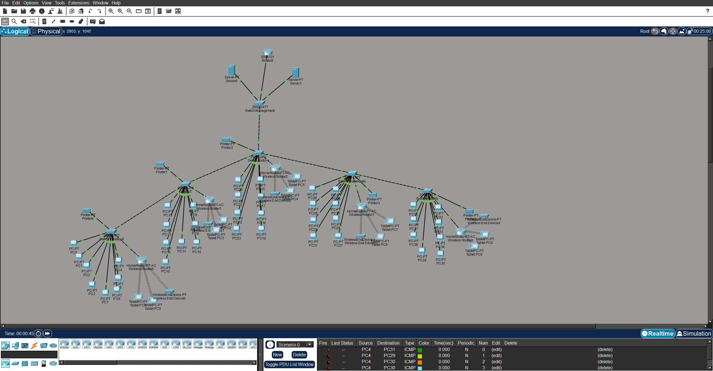

# packet-tracer-skill

[](https://github.com/20hajiyev/packet-tracer-skill/actions/workflows/ci.yml)
[](LICENSE)
[](https://github.com/20hajiyev/packet-tracer-skill)

Cisco Packet Tracer 9.x `.pkt` generator and editor for skill-based coding hosts.

This repository is built for one job: take a natural-language network request, build an explicit scenario-aware plan, adapt a compatible donor lab, and produce a Packet Tracer 9.x workflow that stays open-first and compatibility-first.

It is intended for networking labs where correctness matters more than producing a pretty but unverifiable diagram. The skill can plan, inspect, edit, compare, and explain Packet Tracer scenarios, but it deliberately separates "recognized by the parser", "visible in inventory", "edit-proven", "donor-backed ready", and "generate-ready" support.

`0.2.2` public preview baseline is focused on:

- donor-backed and scenario-aware public messaging
- conservative Windows-first runtime truth
- known working scenario set examples with acceptance-backed artifacts
- README runtime cleanup, advanced wireless feature atlas coverage, and GitHub-launch-ops-ready metadata

## What It Does

`packet-tracer-skill` turns network-lab requests into explicit Packet Tracer workflows. The core loop is:

1. parse the prompt into a scenario family and requested capabilities
2. compare those capabilities against the current support matrix
3. look for a compatible donor lab when strict `.pkt` work is required
4. refuse unsafe or unsupported changes instead of guessing
5. return a decision payload that explains what passed, what failed, and what would make it pass

The current public surface is strongest for these tasks:

- scenario-aware planning for campus, service-heavy, Home IoT, WAN/security edge, IPv6/routing, L2 security/monitoring, and advanced wireless prompts
- explicit `.pkt` edits for proven command shapes such as VLAN, DHCP, ACL, server services, IPv6/routing subsets, L2 security/monitoring subsets, Home IoT constrained edits, and narrow advanced wireless edits
- capability parity reports that explain whether a prompt is inventory-known, edit-supported, donor-limited, acceptance-gated, or unsupported
- runtime diagnostics for Packet Tracer installation, donor path, Twofish bridge resolution, and blocked versus ready operations
- public proof artifacts through examples, inventory manifests, acceptance excerpts, and donor proof docs

## What It Does Not Claim

The project is intentionally conservative. It does not claim universal Packet Tracer automation.

- It does not claim every Packet Tracer feature is generate-ready.
- It does not synthesize arbitrary `.pkt` internals when donor or acceptance evidence is weak.
- It does not treat a successful skill install as proof that real `.pkt` decode/edit/generate is ready.
- It does not commit raw `.pkt` donor labs or local bridge binaries into the public package.
- It does not claim repo-local self-contained runtime readiness when validation depends on an external bridge override.

The feature atlas exists so unsupported and under-modelled Packet Tracer areas are visible instead of hidden. The intended path is: map the feature, prove inventory visibility, prove edit roundtrip, add donor-backed readiness, and only then consider generate readiness.

## Why It Is Different

`packet-tracer-skill` is not a generic topology sketcher. It is a donor-backed Packet Tracer workflow with strict refusal behavior:

- generation stays `single-donor apply`
- unsupported and acceptance-gated mutations do not fall back to guessed output
- `--explain-plan`, `--compare-scenarios`, `--parity-report`, and `--doctor` are first-class product surfaces
- curated donor evidence, fixture corpus checks, and runtime doctor output are part of the contract

In practice, that means the tool is trying to solve a narrower but more defensible problem than a prompt-to-diagram generator. It is designed to answer three questions in order:

1. what the prompt is actually asking for
2. whether the requested capability set is really supported for this scenario family
3. whether a compatible donor and runtime path exist to carry the request safely

If the answer to any of those is weak, the tool is expected to stop and explain why. That refusal behavior is part of the intended product quality, not a temporary limitation.

Current product strengths:

- `open-first` generate guard
- donor-aware and scenario-aware decision layer
- `compare-scenarios`, `capability_parity`, curated donor registry
- runtime doctor contract with bridge resolution
- known working examples with screenshots and acceptance excerpts

## Runtime Reality

Use the same repository, then install it into the skill path your host expects.

There are two separate installation stories:

- installing the skill package into Codex, Cursor, Claude, Gemini, Kiro, AdaL, OpenCode, or a custom skill directory
- making the local machine capable of opening, decoding, editing, and regenerating real Packet Tracer `.pkt` files

The first story is handled by the npm installer. The second story depends on Packet Tracer 9.0, a compatible donor lab, and a local Twofish bridge. This is why the README keeps repeating the runtime distinction: a host can install the skill successfully while strict `.pkt` operations are still blocked.

| Tool | Install | First Use |
| --- | --- | --- |
| Codex CLI | `npx packet-tracer-skill` | `Use pkt to build a Packet Tracer lab with VLAN and DHCP` |
| Cursor | `npx packet-tracer-skill --cursor` | `@pkt build a Packet Tracer lab with VLAN and DHCP` |
| Claude Code | `npx packet-tracer-skill --claude` | `Use /pkt to build a Packet Tracer lab with VLAN and DHCP` |
| Claude Desktop | `npx packet-tracer-skill --path <claude-desktop-skills-dir>` | `Use pkt to build a Packet Tracer lab with VLAN and DHCP` |
| Gemini CLI | `npx packet-tracer-skill --path <gemini-skills-dir>` | `Use pkt to build a Packet Tracer lab with VLAN and DHCP` |
| Kiro CLI / IDE | `npx packet-tracer-skill --kiro` | `Use pkt to build a Packet Tracer lab with VLAN and DHCP` |
| AdaL CLI | `npx packet-tracer-skill --adal` | `Use pkt to build a Packet Tracer lab with VLAN and DHCP` |
| OpenCode | `npx packet-tracer-skill --path .agents/skills` | `opencode run @pkt build a Packet Tracer lab with VLAN and DHCP` |
| Custom path | `npx packet-tracer-skill --path ./my-skills` | depends on the host |

The installer can be used on multiple hosts, but real `.pkt` runtime remains Windows-first and doctor-governed.

That distinction matters because this project has two different surfaces:

- installer or skill-copy success
- actual Packet Tracer decode/edit/generate readiness

The first one is relatively portable. The second one is not. README, npm text, release notes, and doctor output all need to preserve that difference or they become misleading.

| Platform | Installer / skill copy | Real `.pkt` runtime |
| --- | --- | --- |
| Windows | Supported | Acceptance-verified |
| macOS | Partially supported | Runtime contract defined, not acceptance-verified |
| Linux | Partially supported | Runtime contract defined, not acceptance-verified |

Important runtime rule:

- installer success is not the same thing as runtime readiness
- `--doctor` is the authority for whether real `.pkt` operations are ready
- repo-local bridge and external bridge are reported separately
- current strict validation is Windows-first and external-bridge-assisted
- `validate_open` can be ready while strict decode/edit/generate are still blocked

The mixed case is especially important. If `validate_open` works, that only proves Packet Tracer can be launched. It does not prove the current checkout can decode or regenerate `.pkt` files safely. For strict work, donor availability and Twofish bridge resolution still decide the outcome.

## Quick Start

Default install for Codex:

```powershell
npx packet-tracer-skill
```

Bootstrap install:

```powershell
npx packet-tracer-skill --bootstrap
```

Verification:

```powershell
npx packet-tracer-skill --verify
npx packet-tracer-skill --verify --cursor
```

Runtime doctor:

```powershell
npx packet-tracer-skill --doctor
python .\scripts\runtime_doctor.py
```

Local development:

```powershell
git clone https://github.com/20hajiyev/packet-tracer-skill.git
cd .\packet-tracer-skill
powershell -ExecutionPolicy Bypass -File .\scripts\setup.ps1 -Dev
```

Launch references:

- [docs/release-notes-0.2.2.md](docs/release-notes-0.2.2.md)
- [docs/hero-demo-plan.md](docs/hero-demo-plan.md)
- [docs/github-metadata.md](docs/github-metadata.md)
- [docs/release-checklist.md](docs/release-checklist.md)
- [docs/github-launch-ops-0.2.2.md](docs/github-launch-ops-0.2.2.md)
- [docs/campus-donor-proof.md](docs/campus-donor-proof.md)
- [docs/home-iot-donor-proof.md](docs/home-iot-donor-proof.md)
- [docs/wan-security-donor-proof.md](docs/wan-security-donor-proof.md)
- [docs/wireless-advanced-proof.md](docs/wireless-advanced-proof.md)
- [docs/packet-tracer-feature-gap-atlas.md](docs/packet-tracer-feature-gap-atlas.md)

## Runtime Doctor Contract

`--doctor` is a product surface, not a debug afterthought. It reports:

- `capability_impact`
- `runtime_blockers`
- `blocked_operations`
- `ready_operations`
- `what_currently_works`
- `what_is_blocked`
- `why_it_is_blocked`
- `best_next_fix`
- `recommended_next_steps`
- `doctor_summary`
- `runtime_grade`
- `bridge_resolution`
- `bridge_path_source`
- `bridge_recommendation`
- `runtime_contract_notes`

Bridge resolution states:

- `repo_local`
- `external_env`
- `missing`

Runtime grade states:

- `ready`
- `partially_ready`
- `blocked`

Important distinction:

- tests can pass with an external bridge override
- that does not mean the repo is self-contained runtime-ready
- the difference between repo-local readiness and external bridge fallback is part of the public contract
- mixed states should still read like a decision guide, not a debug dump

Selector and runtime are intentionally kept separate:

- donor selection can still block a prompt even when runtime is healthy
- runtime can still block strict `.pkt` work even when a donor artifact exists
- campus donor proof currently shows the first case more clearly than the second

Runtime truth reference:

- [docs/runtime-truth.md](docs/runtime-truth.md)
- [docs/post-launch-follow-up.md](docs/post-launch-follow-up.md)

## Runtime Configuration

Set the local Packet Tracer environment before real `.pkt` generation:

```powershell
$env:PACKET_TRACER_ROOT='C:\Program Files\Cisco Packet Tracer 9.0.0'
$env:PACKET_TRACER_COMPAT_DONOR='C:\path\to\your-working-9.0-donor.pkt'
```

Important variables:

- `PACKET_TRACER_ROOT`
- `PACKET_TRACER_SAVES_ROOT`
- `PACKET_TRACER_EXE`
- `PACKET_TRACER_COMPAT_DONOR`
- `PACKET_TRACER_TARGET_VERSION`
- `PKT_TWOFISH_LIBRARY`
- `PKT_TWOFISH_SEARCH_ROOTS`

Twofish bridge setup is intentionally local-machine specific. Use a path that exists on your own machine.

Generic explicit bridge path:

```powershell
$env:PKT_TWOFISH_LIBRARY="C:\path\to\_twofish.cp314-win_amd64.pyd"
```

Repo-local bridge path, if you have placed a compatible bridge inside this
checkout:

```powershell
$env:PKT_TWOFISH_LIBRARY="$PWD\scripts\vendor\_twofish.cp314-win_amd64.pyd"
```

Search-root fallback, if you want the runtime to look inside a local bridge
folder:

```powershell
$env:PKT_TWOFISH_SEARCH_ROOTS="C:\path\to\bridge-folder"
```

Developer-local bridge paths are valid only for the person and host where that bridge exists. They are not the public setup contract.

Required policy:

- keep `PACKET_TRACER_TARGET_VERSION` on `9.0.0.0810`
- do not downgrade the workflow to `5.3`
- if donor or bridge is missing, fix the runtime instead of weakening the compatibility profile

Troubleshooting guide:

- `bridge_resolution=repo_local` means the checkout contains the bridge path the doctor resolved.
- `bridge_resolution=external_env` means an environment variable points to a bridge outside the repo. This can be valid for testing, but it is not repo self-contained readiness.
- `bridge_resolution=missing` means strict decode/edit/generate is blocked until `PKT_TWOFISH_LIBRARY` or `PKT_TWOFISH_SEARCH_ROOTS` resolves a compatible bridge.
- `validate_open` readiness only proves Packet Tracer can launch a file. Strict `.pkt` generation still depends on donor and bridge readiness.

## Core Product Surfaces

The CLI is not only a generator entrypoint. It is also the inspection surface for deciding whether a request is safe. In normal development, start with the reporting commands before expecting a final `.pkt` output.

Use `--explain-plan` when you need the full decision payload:

```powershell
python .\scripts\generate_pkt.py --explain-plan "6 department campus with router-on-a-stick, VLAN, DHCP, management VLAN, Telnet, ACL"
```

Use `--compare-scenarios` when you need scenario comparison:

```powershell
python .\scripts\generate_pkt.py --compare-scenarios "campus with VLAN DHCP ACL" --compare-scenarios "smart home with IoT registration" --matrix-out .\output\compare.json
```

Use `--parity-report` for prompt-scoped capability readiness:

```powershell
python .\scripts\generate_pkt.py --parity-report "service-heavy lab with DNS DHCP FTP email syslog AAA"
```

Use `--feature-gap-report` for the Packet Tracer 9.0 feature atlas:

```powershell
python .\scripts\generate_pkt.py --feature-gap-report
```

The atlas now distinguishes report-only features from edit-proven features. IPv6/routing, a constrained L2 security/monitoring subset, and a narrow advanced-wireless edit subset can be edited with explicit commands, but none of these are claimed as broad generate-ready without donor-backed acceptance evidence.

Support levels used by the atlas:

- `not_mapped`: the feature is known as a Packet Tracer area, but this repo does not yet model it.
- `inventory_known`: the feature can be discovered or inferred from sample/catalog evidence.
- `report_supported`: prompts and reports can talk about the feature without claiming edits.
- `edit_proven`: explicit command shapes have editor roundtrip evidence.
- `donor_backed_ready`: a selected donor can safely carry the capability for a prompt-scoped workflow.
- `generate_ready`: strict generate support is acceptance-backed for that scenario.

Current feature-support truth:

| Area | Current status | Safe action |
| --- | --- | --- |
| Campus / service-heavy / Home IoT / WAN-security scenario families | Donor-aware planning and parity/report surfaces | Use `--explain-plan`, `--compare-scenarios`, and donor proof docs before strict generate claims |
| IPv6/routing | Edit-proven subset | Use explicit router/interface commands; strict generate still needs selected-donor acceptance |
| L2 security/monitoring | Edit-proven subset | Use explicit DHCP snooping, DAI, LLDP, REP, SNMP, NetFlow, SPAN/RSPAN, and port-security commands |
| WAN/security edge | GRE, PPP, IPSec transform-set, and VPN crypto-map skeleton are explicit-edit capable; ASA policies and multilayer switching remain report-only | Use explicit router edit commands; strict generate still needs selected-donor acceptance |
| Advanced wireless | WEP and WPA Enterprise/RADIUS are explicit-edit capable; WLC, Meraki, cellular, Bluetooth, beamforming, and guest Wi-Fi remain report-only | Keep controller/cellular/Bluetooth claims in atlas/report mode until donor-backed proof exists |
| Voice, automation/controller, industrial IoT, physical/media gaps | Report-supported atlas entries | Do not claim edit/generate support until a proof wave promotes them |

The important number is still `generate_ready=0` for the atlas gap families. That is deliberate: visibility comes first, then edit proof, then donor-backed readiness, and only then generate readiness.

Stable CLI surfaces:

- `--explain-plan`
- `--compare-scenarios`
- `--matrix-out`
- `--coverage-report`
- `--feature-gap-report`
- `--inventory-capabilities`
- `--doctor`
- `--parity-report`
- `--acceptance-json-out`

## Curated Donor and Fixture Truth Sources

This repository keeps explicit truth sources for donor evidence and scenario regression:

- `references/curated-donor-registry.json`
- `references/scenario-fixture-corpus.json`
- `references/packettracer-feature-atlas.json`

Curated donor registry reference:

- [docs/curated-donor-registry.md](docs/curated-donor-registry.md)

The registry is not a marketing list. It is a control surface for deciding which donor classes can be trusted for which scenario families. A donor can be useful for inventory and proof while still being rejected for a larger prompt if the skeleton does not safely match the requested topology.

Current selector truth:

- a registry-backed donor can be inventory-proof without being prompt-selected
- selector output should explain the closest rejected donor class when generate is blocked
- `best_rejected_donor_class` and `primary_rejection_code` are intended to keep donor-limited refusals specific
- Home IoT readiness is only raised when the selected donor and prompt targets are both deterministic
- WAN/security readiness is only raised for explicit WAN/security intent when the selected donor carries matching WAN, security, tunnel, or multilayer runtime evidence
- Feature atlas entries are report-first; a feature can be visible in the atlas while still blocked for edit/generate.

## Known Working Scenario Set

Public examples stay text-first and review-friendly. Raw `.pkt` binaries are not committed.

These examples are not decorative screenshots. They are the public proof set for the current product contract. Each one is intended to show a scenario family that was actually exercised through donor-backed logic and then reduced into reviewable artifacts:

- screenshot
- inventory manifest
- acceptance excerpt
- parity excerpt
- decision excerpt
- runtime excerpt

This is why the examples surface matters so much in release work. It is the shortest path from a marketing claim to a falsifiable engineering artifact.

Canonical public examples:

- `complex_campus_master_edit_v4`
- `home_iot_cli_edit_v1`
- `service_heavy_cli_edit_v1`

Gallery and manifests:

```powershell
python .\scripts\build_examples_index.py
Get-Content .\examples\gallery.md
Get-Content .\examples\index.json
```

Primary screenshot:



Hero visual for the `0.2.2` public preview surface:

- `examples/screenshots/complex_campus_master_edit_v4.png`

The gallery is treated as a known working scenario set, not just a screenshot list, and the same canonical set feeds release notes and GitHub metadata.

Canonical public proof:

- [docs/campus-donor-proof.md](docs/campus-donor-proof.md)
- [docs/home-iot-donor-proof.md](docs/home-iot-donor-proof.md)
- [docs/wan-security-donor-proof.md](docs/wan-security-donor-proof.md)

The campus donor proof is intentionally more specific than the gallery cards. It shows that a real donor artifact inventories correctly, but it also shows that a generalized campus prompt can still be donor-limited. That is exactly the kind of nuance the public docs should preserve.

The Home IoT donor proof is intentionally narrower than a generic smart-home claim. It shows that donor-backed registration, rule control, and wireless association are integrated only inside a constrained path with explicit targets and a selected donor.

The WAN/security donor proof is also conservative. It shows family-correct report/selection behavior, donor-backed readiness semantics, and a narrow explicit-edit subset for GRE, PPP, IPSec transform-set, and VPN crypto-map skeletons. It does not claim broad synthetic WAN/security configuration generation.

The advanced wireless proof is narrower again. It promotes only explicit WEP and WPA Enterprise/RADIUS edit semantics while keeping WLC, Meraki, cellular, Bluetooth, beamforming, and guest Wi-Fi in report-only atlas mode.

What the proof now tries to surface explicitly:

- a real donor exists
- inventory succeeds
- the larger generalized prompt is still refused
- the blocking layer is donor selection, not runtime
- the closest rejected donor class and rejection code should be visible in the decision payload

Classifier truth matters here too:

- shorthand campus prompts should still resolve to the `campus` family
- donor-limited campus refusal should be read as a campus selector result, not a service-heavy misclassification

## Security and Privacy

This repo is prepared to avoid accidental sharing of local private material:

- no hardcoded donor path is committed
- no `C:\Users\<name>\...` donor path is baked into config
- generated `.pkt` and `.xml` files are gitignored
- public sample labs should be committed as inventory JSON or blueprint JSON, not raw `.pkt` binaries
- Twofish bridge binaries are gitignored by default

Before publishing:

- verify your own `PACKET_TRACER_COMPAT_DONOR` path is local-only
- do not commit generated labs unless you intend to share them
- do not commit locally built bridge binaries unless you reviewed them

See also:

- [CONTRIBUTING.md](CONTRIBUTING.md)
- [SECURITY.md](SECURITY.md)
- [docs/release-checklist.md](docs/release-checklist.md)
- [docs/github-discussions-setup.md](docs/github-discussions-setup.md)

## Release and Launch State

The npm package is published as `packet-tracer-skill@0.2.2`. Remaining launch ops are GitHub release application, About/Topics updates, Discussions setup, and public proof follow-up.

So the current state is no longer "preparing to publish." The package line is public. The remaining work is about making the public surface honest and complete:

- GitHub release object should match the published npm state
- About/Topics should match the README and launch wording
- Discussions should exist as the feedback intake surface
- donor proof should exist as the first post-launch technical evidence layer

That is the difference between "published" and "productized." The current repo is published; these follow-up documents are what make it operationally coherent.

Recommended local validation before release:

```powershell
python .\scripts\build_examples_index.py
python -m pytest tests -q
node --check .\bin\packet-tracer-skill.js
python .\scripts\generate_pkt.py --parity-report "campus with VLAN DHCP ACL"
python .\scripts\runtime_doctor.py
```

Launch ops references:

- [docs/release-checklist.md](docs/release-checklist.md)
- [docs/publish-preview-roadmap.md](docs/publish-preview-roadmap.md)
- [docs/discovery-keywords.md](docs/discovery-keywords.md)
- [docs/github-metadata.md](docs/github-metadata.md)
- [docs/github-launch-ops-0.2.2.md](docs/github-launch-ops-0.2.2.md)
- [docs/post-launch-follow-up.md](docs/post-launch-follow-up.md)

## Azerbaijani Summary

Bu repo təbii dil ilə Cisco Packet Tracer `.pkt` faylları üçün planlama, analiz, edit və donor-backed generate workflow-u qurmaq üçündür. Məqsəd sadəcə "prompt yaz, topologiya çək" deyil. Məqsəd Packet Tracer-in real `.pkt` formatına uyğun, donor sübutu olan, runtime vəziyyəti yoxlanmış və səhv olanda açıq səbəb göstərən daha etibarlı workflow yaratmaqdır.

Əsas fərq budur: skill təhlükəsiz olmayan halda özündən nəticə uydurmur. Əgər donor uyğun deyil, runtime bridge yoxdur, capability hələ acceptance-backed deyil, ya da prompt çox genişdirsə, sistem final `.pkt` yaratmaq əvəzinə refusal və remediation qaytarır. Bu davranış zəiflik deyil; Packet Tracer faylını korlamamaq üçün əsas product qaydasıdır.

Əsas public səthlər:

- `--explain-plan`: prompt-un hansı scenario family və capability-lərə çevrildiyini, hansı donor/readiness qərarlarının verildiyini göstərir.
- `--compare-scenarios`: bir neçə prompt-u eyni matrix üzərində müqayisə edir və hansı ailənin daha hazır, donor-limited və ya unsupported olduğunu göstərir.
- `--parity-report`: tələb olunan capability-lərin inventory, edit, generate və acceptance səviyyəsində vəziyyətini izah edir.
- `--feature-gap-report`: Packet Tracer 9.0-da mövcud olub skill-də hələ tam məhsullaşmamış sahələri atlas/backlog kimi göstərir.
- `--doctor`: real `.pkt` runtime üçün Packet Tracer install, donor path, Twofish bridge və blocked/ready operations vəziyyətini yoxlayır.
- examples gallery və proof docs: screenshot, inventory manifest, acceptance excerpt və donor proof ilə public iddiaları yoxlanıla bilən artefaktlara bağlayır.

Hazırda ən güclü sahələr:

- campus və service-heavy lab planning/parity/reporting
- donor-backed Home IoT constrained edits
- WAN/security edge report və donor-backed readiness semantics
- WAN/security edge üçün GRE, PPP, IPSec transform-set və VPN crypto-map explicit edit semantics
- IPv6/routing üçün explicit edit-proven subset
- L2 security/monitoring üçün explicit edit-proven subset
- advanced wireless üçün WEP və WPA Enterprise/RADIUS explicit edit semantics

Hələ konservativ saxlanan sahələr:

- broad synthetic generate bütün Packet Tracer feature-ləri üçün açıq deyil
- WLC, Meraki, cellular, Bluetooth, beamforming və guest Wi-Fi report-only qalır
- voice, automation/controller, industrial IoT və physical/media feature-lər atlasda görünür, amma donor-backed edit/generate iddiası almır
- repo-local self-contained runtime readiness iddia edilmir; external bridge-assisted validation ayrıca göstərilir

Hazırkı prioritet:

- `0.2.2` public preview hardening
- README / npm / GitHub discoverability hizalanması
- scenario truth source, donor registry və runtime doctor contract consistency
- feature atlas üzərindən Packet Tracer-də qalan bütün boşluqları görünən backlog-a çevirmək
- yeni capability-ləri yalnız inventory proof, edit roundtrip proof və donor-backed acceptance olduqda yüksəltmək

## License

This project is licensed under the MIT License.
