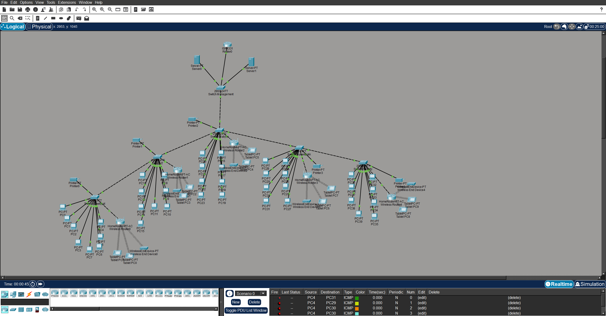

# packet-tracer-skill

[](https://github.com/20hajiyev/packet-tracer-skill/actions/workflows/ci.yml)
[](LICENSE)
[](https://github.com/20hajiyev/packet-tracer-skill)

Cisco Packet Tracer 9.x `.pkt` generator and editor for skill-based coding hosts.

This repository is built for one job: take a natural-language network request, build an explicit scenario-aware plan, adapt a compatible donor lab, and produce a Packet Tracer 9.x workflow that stays open-first and compatibility-first.

It is intended for networking labs where correctness matters more than producing a pretty but unverifiable diagram. The skill can plan, inspect, edit, compare, and explain Packet Tracer scenarios, but it deliberately separates "recognized by the parser", "visible in inventory", "edit-proven", "donor-backed ready", and "generate-ready" support.

## What `0.3.0` does

In this release a prompt produces a lab Packet Tracer opens.

```bash
npx packet-tracer-skill --doctor        # is this machine ready?
python scripts/generate_pkt.py --prompt "1 router 1 switch 4 komputer, DHCP ile avtomatik IP payla" --output lab.pkt
```

The connectivity numbers below come from running `ping` on the devices, not from
inspecting the file.

| measurement | result |
| --- | --- |
| corpus scenarios generated | 32 of 33 (the 33rd asks for no devices and is refused) |
| of those, opened by Packet Tracer | 31 of 32 |
| tests | 824 passed, 1 skipped |
| generated DHCP lab | four PCs took leases from the router pool and pinged their gateway and each other 4/4 |
| generated leased line | traffic crossed `Serial0/1/1 <-> Serial0/1/0` 4/4 |
| generated home-router lab | both hosts pinged the gateway and each other 4/4 |

Three defects had made every generated WAN lab unopenable, each hiding the next.
A donor the selector had *rejected* still rewrote the request, so a planned
serial link became copper before any other donor could serve it. Interface names
were invented from an assumed switch model instead of read from the device. And
serial cables carried no clocking end. Two of the three stayed invisible until
the open check itself was fixed, since it had been returning false verdicts often
enough to send investigations after defects that were not there.

Two different numbers in this README both describe generation. The one above is
donor-prune generation: a real lab is pruned and rewired to match the request.
The atlas `generate_ready` count further down is a stricter per-feature
acceptance gate, still `0` by design.

**One thing to know before you ask for Wi-Fi.** A lab whose hosts reach the
network over a *cable* is verified by ping here. A lab whose hosts have only a
radio is not: Packet Tracer does not re-form the association when it opens such
a file, so the client shows its port `up` and `linked`, holds no address, and
reaches nothing until you nudge a device in the workspace. Which of the two you
get depends on the donor -- one whose laptops carry a copper port produces the
first, one whose laptops carry only a radio produces the second. The generator
now makes the client agree with its network in every field that can be written
(name, security, key, addressing mode, and placement inside the access point's
coverage), and that is still not sufficient. Treat wireless-only topologies as
unverified.

The previous line, the `0.2.3` capability release, was focused on:

- donor-backed and scenario-aware public messaging
- conservative Windows-first runtime truth
- known working scenario set examples with acceptance-backed artifacts
- expanded edit-proven capability proof across voice, automation, L2 security, WAN/security, BGP/L2 resiliency, IPv4 routing/NAT, IOS management, and local sample audit workflows

## What It Does

`packet-tracer-skill` turns network-lab requests into explicit Packet Tracer workflows. The core loop is:

1. parse the prompt into a scenario family and requested capabilities
2. compare those capabilities against the current support matrix
3. look for a compatible donor lab when strict `.pkt` work is required
4. refuse unsafe or unsupported changes instead of guessing
5. return a decision payload that explains what passed, what failed, and what would make it pass

The current public surface is strongest for these tasks:

- scenario-aware planning for campus, service-heavy, Home IoT, WAN/security edge, IPv6/routing, IPv4 routing/management, L2 security/monitoring, L2 resiliency/BGP, and advanced wireless prompts
- explicit `.pkt` edits for proven command shapes such as VLAN, DHCP, ACL, server services, IPv6/routing subsets, IPv4 routing/NAT/IOS-management subsets, L2 security/monitoring subsets, BGP/STP/EtherChannel/VTP/DTP IOS text edits, Home IoT constrained edits, and narrow advanced wireless edits
- capability parity reports that explain whether a prompt is inventory-known, edit-supported, donor-limited, acceptance-gated, or unsupported
- runtime diagnostics for Packet Tracer installation, donor path, Twofish bridge resolution, and blocked versus ready operations
- public proof artifacts through examples, inventory manifests, acceptance excerpts, and donor proof docs

## What It Does Not Claim

The project is intentionally conservative. It does not claim universal Packet Tracer automation.

- It does not claim every Packet Tracer feature is generate-ready.
- It does not synthesize arbitrary `.pkt` internals when donor or acceptance evidence is weak.
- It does not treat a successful skill install as proof that real `.pkt` decode/edit/generate is ready.
- It does not commit raw `.pkt` donor labs or local bridge binaries into the public package.
- It does not claim repo-local self-contained runtime readiness when validation depends on an external bridge override.

The feature atlas exists so unsupported and under-modelled Packet Tracer areas are visible instead of hidden. The intended path is: map the feature, prove inventory visibility, prove edit roundtrip, add donor-backed readiness, and only then consider generate readiness.

## Why It Is Different

`packet-tracer-skill` is not a generic topology sketcher. It is a donor-backed Packet Tracer workflow with strict refusal behavior:

- generation stays `single-donor apply`
- unsupported and acceptance-gated mutations do not fall back to guessed output
- `--explain-plan`, `--compare-scenarios`, `--parity-report`, and `--doctor` are first-class product surfaces
- curated donor evidence, fixture corpus checks, and runtime doctor output are part of the contract

In practice, that means the tool is trying to solve a narrower but more defensible problem than a prompt-to-diagram generator. It is designed to answer three questions in order:

1. what the prompt is actually asking for
2. whether the requested capability set is really supported for this scenario family
3. whether a compatible donor and runtime path exist to carry the request safely

If the answer to any of those is weak, the tool is expected to stop and explain why. That refusal behavior is part of the intended product quality, not a temporary limitation.

Current product strengths:

- `open-first` generate guard
- donor-aware and scenario-aware decision layer
- `compare-scenarios`, `capability_parity`, curated donor registry
- runtime doctor contract with bridge resolution
- known working examples with screenshots and acceptance excerpts

## Runtime Reality

Use the same repository, then install it into the skill path your host expects.

There are two separate installation stories:

- installing the skill package into Codex, Cursor, Claude, Gemini, Kiro, AdaL, OpenCode, or a custom skill directory
- making the local machine capable of opening, decoding, editing, and regenerating real Packet Tracer `.pkt` files

The first story is handled by the npm installer. The second story depends on Packet Tracer 9.0, a compatible donor lab, and a local Twofish bridge. This is why the README keeps repeating the runtime distinction: a host can install the skill successfully while strict `.pkt` operations are still blocked.

| Tool | Install | First Use |
| --- | --- | --- |
| Codex CLI | `npx packet-tracer-skill` | `Use pkt to build a Packet Tracer lab with VLAN and DHCP` |
| Cursor | `npx packet-tracer-skill --cursor` | `@pkt build a Packet Tracer lab with VLAN and DHCP` |
| Claude Code | `npx packet-tracer-skill --claude` | `Use /pkt to build a Packet Tracer lab with VLAN and DHCP` |
| Claude Desktop | `npx packet-tracer-skill --path <claude-desktop-skills-dir>` | `Use pkt to build a Packet Tracer lab with VLAN and DHCP` |
| Gemini CLI | `npx packet-tracer-skill --path <gemini-skills-dir>` | `Use pkt to build a Packet Tracer lab with VLAN and DHCP` |
| Kiro CLI / IDE | `npx packet-tracer-skill --kiro` | `Use pkt to build a Packet Tracer lab with VLAN and DHCP` |
| AdaL CLI | `npx packet-tracer-skill --adal` | `Use pkt to build a Packet Tracer lab with VLAN and DHCP` |
| OpenCode | `npx packet-tracer-skill --path .agents/skills` | `opencode run @pkt build a Packet Tracer lab with VLAN and DHCP` |
| Custom path | `npx packet-tracer-skill --path ./my-skills` | depends on the host |

The installer can be used on multiple hosts, but real `.pkt` runtime remains Windows-first and doctor-governed.

That distinction matters because this project has two different surfaces:

- installer or skill-copy success
- actual Packet Tracer decode/edit/generate readiness

The first one is relatively portable. The second one is not. README, npm text, release notes, and doctor output all need to preserve that difference or they become misleading.

| Platform | Installer / skill copy | Real `.pkt` runtime |
| --- | --- | --- |
| Windows | Supported | Acceptance-verified |
| macOS | Partially supported | Runtime contract defined, not acceptance-verified |
| Linux | Partially supported | Runtime contract defined, not acceptance-verified |

Important runtime rule:

- installer success is not the same thing as runtime readiness
- `--doctor` is the authority for whether real `.pkt` operations are ready
- repo-local bridge and external bridge are reported separately
- current strict validation is Windows-first and external-bridge-assisted
- `validate_open` can be ready while strict decode/edit/generate are still blocked

The mixed case is especially important. If `validate_open` works, that only proves Packet Tracer can be launched. It does not prove the current checkout can decode or regenerate `.pkt` files safely. For strict work, donor availability and Twofish bridge resolution still decide the outcome.

## Quick Start

Default install for Codex:

```powershell
npx packet-tracer-skill
```

Bootstrap install:

```powershell
npx packet-tracer-skill --bootstrap
```

Verification:

```powershell
npx packet-tracer-skill --verify
npx packet-tracer-skill --verify --cursor
```

Runtime doctor:

```powershell
npx packet-tracer-skill --doctor
python .\scripts\runtime_doctor.py
```

First-run workflow for real use:

1. Run `npx packet-tracer-skill --doctor` or `python .\scripts\runtime_doctor.py`.
2. Read `runtime_grade`, `ready_operations`, `blocked_operations`, and `best_next_fix`.
3. If runtime is blocked, fix Packet Tracer root, donor path, or Twofish bridge before expecting real `.pkt` decode/edit/generate.
4. Run `python .\scripts\generate_pkt.py --parity-report "<your prompt>"` to see whether the scenario is report-only, edit-proven, donor-backed-ready, or generate-ready.
5. Run `python .\scripts\generate_pkt.py --explain-plan "<your prompt>"` when parity says the prompt is blocked; the `user_summary`, `next_best_action`, and `proof_card_refs` fields are the fastest path to the next correct action.
6. Check `examples/gallery.md` when you need a known working example, proof card, or local evidence summary before attempting a new donor-backed workflow.

Local development:

```powershell
git clone https://github.com/20hajiyev/packet-tracer-skill.git
cd .\packet-tracer-skill
powershell -ExecutionPolicy Bypass -File .\scripts\setup.ps1 -Dev
```

Launch references:

- [docs/release-notes-0.2.3.md](docs/release-notes-0.2.3.md)
- [docs/release-notes-0.2.4.md](docs/release-notes-0.2.4.md)
- [docs/hero-demo-plan.md](docs/hero-demo-plan.md)
- [docs/github-metadata.md](docs/github-metadata.md)
- [docs/release-checklist.md](docs/release-checklist.md)
- [docs/github-launch-ops-0.2.3.md](docs/github-launch-ops-0.2.3.md)
- [docs/proof-readiness-dashboard.md](docs/proof-readiness-dashboard.md)
- [docs/campus-donor-proof.md](docs/campus-donor-proof.md)
- [docs/home-iot-donor-proof.md](docs/home-iot-donor-proof.md)
- [docs/wan-security-donor-proof.md](docs/wan-security-donor-proof.md)
- [docs/wireless-advanced-proof.md](docs/wireless-advanced-proof.md)
- [docs/industrial-programming-proof.md](docs/industrial-programming-proof.md)
- [docs/automation-controller-proof.md](docs/automation-controller-proof.md)
- [docs/voice-collaboration-proof.md](docs/voice-collaboration-proof.md)
- [docs/l2-resiliency-bgp-proof.md](docs/l2-resiliency-bgp-proof.md)
- [docs/ipv4-routing-management-proof.md](docs/ipv4-routing-management-proof.md)
- [docs/l2-security-qos-proof.md](docs/l2-security-qos-proof.md)
- [docs/security-edge-deepening-proof.md](docs/security-edge-deepening-proof.md)
- [docs/packet-tracer-feature-gap-atlas.md](docs/packet-tracer-feature-gap-atlas.md)

## Runtime Doctor Contract

`--doctor` is a product surface, not a debug afterthought. It reports:

- `capability_impact`
- `runtime_blockers`
- `blocked_operations`
- `ready_operations`
- `what_currently_works`
- `what_is_blocked`
- `why_it_is_blocked`
- `best_next_fix`
- `recommended_next_steps`
- `doctor_summary`
- `runtime_grade`
- `bridge_resolution`
- `bridge_path_source`
- `bridge_recommendation`
- `runtime_contract_notes`

Bridge resolution states:

- `repo_local`
- `external_env`
- `missing`

Runtime grade states:

- `ready`
- `partially_ready`
- `blocked`

Important distinction:

- tests can pass with an external bridge override
- that does not mean the repo is self-contained runtime-ready
- the difference between repo-local readiness and external bridge fallback is part of the public contract
- mixed states should still read like a decision guide, not a debug dump

Selector and runtime are intentionally kept separate:

- donor selection can still block a prompt even when runtime is healthy
- runtime can still block strict `.pkt` work even when a donor artifact exists
- campus donor proof currently shows the first case more clearly than the second

Runtime truth reference:

- [docs/runtime-truth.md](docs/runtime-truth.md)
- [docs/post-launch-follow-up.md](docs/post-launch-follow-up.md)

## Runtime Configuration

Set the local Packet Tracer environment before real `.pkt` generation:

```powershell
$env:PACKET_TRACER_ROOT='C:\Program Files\Cisco Packet Tracer 9.0.0'
$env:PACKET_TRACER_COMPAT_DONOR='C:\path\to\your-working-9.0-donor.pkt'
```

Important variables:

- `PACKET_TRACER_ROOT`
- `PACKET_TRACER_SAVES_ROOT`
- `PACKET_TRACER_EXE`
- `PACKET_TRACER_COMPAT_DONOR`
- `PACKET_TRACER_TARGET_VERSION`
- `PKT_TWOFISH_LIBRARY`
- `PKT_TWOFISH_SEARCH_ROOTS`

**None of these are required.** The skill resolves all of them on its own; set
one only to override what it found.

### Twofish

Nothing to install. `scripts/vendor/twofish_pure.py` is a pure-Python Twofish
that ships in the checkout and passes the official test vectors, so decode,
edit and generate work with no binaries and no environment variables.

A compiled bridge is an optional accelerator, worth setting only for repeated
work on very large labs (~12x on the Twofish step):

```powershell
$env:PKT_TWOFISH_LIBRARY="C:\path\to\_twofish.cp314-win_amd64.pyd"
$env:PKT_TWOFISH_SEARCH_ROOTS="C:\path\to\bridge-folder"   # or search a folder
```

### Target version

Do not pin `PACKET_TRACER_TARGET_VERSION`. Packet Tracer refuses any lab whose
`<VERSION>` build differs from its own, so the correct value is whatever build
is installed on *your* machine, and the skill detects it:

1. `PACKET_TRACER_TARGET_VERSION`, if you set it
2. the Packet Tracer binary's own version resource (Windows)
3. a lab the local install has saved
4. the install directory name, which gives a release but no build

Steps 2 and 3 are the ones that yield a full four-field build. Only a donor
carrying that exact build can serve as a generation base -- bundled Cisco
samples ship as `9.0.0.0000` and produce files Packet Tracer rejects.

Troubleshooting:

- `twofish_backend=pure_python` is the normal, fully supported state.
- `bridge_resolution=missing` means only that no compiled accelerator was
  found. It does not block anything.
- `validate_open` readiness proves Packet Tracer can launch a file. Generation
  additionally needs an eligible donor -- run `runtime_doctor.py` to see which.

## Core Product Surfaces

The CLI is not only a generator entrypoint. It is also the inspection surface for deciding whether a request is safe. In normal development, start with the reporting commands before expecting a final `.pkt` output.

Use `--explain-plan` when you need the full decision payload:

```powershell
python .\scripts\generate_pkt.py --explain-plan "6 department campus with router-on-a-stick, VLAN, DHCP, management VLAN, Telnet, ACL"
```

Use `--compare-scenarios` when you need scenario comparison:

```powershell
python .\scripts\generate_pkt.py --compare-scenarios "campus with VLAN DHCP ACL" --compare-scenarios "smart home with IoT registration" --matrix-out .\output\compare.json
```

Use `--parity-report` for prompt-scoped capability readiness:

```powershell
python .\scripts\generate_pkt.py --parity-report "service-heavy lab with DNS DHCP FTP email syslog AAA"
```

Use `--feature-gap-report` for the Packet Tracer 9.0 feature atlas:

```powershell
python .\scripts\generate_pkt.py --feature-gap-report
```

## GitHub Sample Ingestion Is Local/Cache-Only

The skill can search GitHub for public Packet Tracer sample repositories when you explicitly opt in with `--search-remote`. This is a developer workflow for collecting evidence, not a promise that downloaded labs become trusted donors or package assets.

Remote ingestion rules:

- imported `.pkt` and `.pka` files stay under `output/remote-import-cache` by default
- `output/remote-import-cache` is local-only and is not included in the npm package
- unknown or missing license metadata is treated as `reference_only`
- permissive-license repositories, such as MIT, only become curated donor candidates after decode and inventory validation
- decode-fail samples can contribute sample-path evidence, but they never create edit, donor-backed, or generate-ready claims
- final `.pkt` apply still uses the same `single-donor` safety rule

Preview GitHub candidates without downloading archives:

```powershell
python .\scripts\generate_pkt.py --explain-plan "ipv6 ospf hsrp lab" --search-remote --remote-dry-run --max-remote-results 3
```

Import into the local cache and write the audit report:

```powershell
python .\scripts\generate_pkt.py --explain-plan "ipv6 ospf hsrp lab" --search-remote --max-remote-results 3 --remote-audit-out output\remote-import-cache\remote-sample-audit.json
```

## Local Sample Audit Is Evidence-Only

If you have your own Packet Tracer lab folder, audit it locally instead of copying raw `.pkt` files into this repo:

```powershell
python .\scripts\generate_pkt.py --local-sample-audit-root "C:\path\to\pkt_examples"
```

By default this writes `output/local-sample-audit.json`. That file is local-only and ignored by git/npm packaging. The audit reports total `.pkt/.pka` files, decode success/fail counts, detected config capabilities, top device types, and local promotion candidates. It is evidence for future proof waves, not a curated donor registry entry by itself.

Use an explicit output path when you want to compare audit snapshots:

```powershell
python .\scripts\generate_pkt.py --local-sample-audit-root "C:\path\to\pkt_examples" --local-sample-audit-out output\local-sample-audit.json
```

Local evidence still follows the same maturity ladder: sample path evidence, decode evidence, inventory proof, editor roundtrip proof, donor-backed readiness, then possible generate readiness. Raw user-supplied `.pkt/.pka` files are not committed or published.

The generated audit is local by design:

- `repo_url`, license, default branch, import status
- imported `.pkt` / `.pka` / README / LICENSE counts
- decode success and failure counts
- detected feature tags when decode succeeds
- license-based candidate promotion status and decode-gated validation status

The atlas now distinguishes report-only features, edit-proven features, and donor-backed edit readiness. IPv6/routing, IPv4 routing/NAT/IOS management, a constrained L2 security/monitoring subset, BGP + L2 resiliency IOS text edits, router-based CBAC/ZFW, a narrow WAN/security subset, and a narrow advanced-wireless subset can be edited with explicit commands. Real HTTP/WebSocket, OSPFv3, EIGRP IPv6, RIPng, HSRP, dot1x, ZFW, voice IOS, and selected programming script-file edits are donor-backed-ready proof paths. None of these are claimed as broad generate-ready without acceptance evidence.

Support levels used by the atlas:

- `not_mapped`: the feature is known as a Packet Tracer area, but this repo does not yet model it.
- `inventory_known`: the feature can be discovered or inferred from sample/catalog evidence.
- `report_supported`: prompts and reports can talk about the feature without claiming edits.
- `edit_proven`: explicit command shapes have editor roundtrip evidence.
- `donor_backed_ready`: a selected donor or proof-linked explicit edit path can safely carry the capability for a prompt-scoped workflow.
- `generate_ready`: strict generate support is acceptance-backed for that scenario.

Current feature-support truth:

| Area | Current status | Safe action |
| --- | --- | --- |
| Campus / service-heavy / Home IoT / WAN-security scenario families | Donor-aware planning and parity/report surfaces | Use `--explain-plan`, `--compare-scenarios`, and donor proof docs before strict generate claims |
| IPv6/routing | OSPFv3, EIGRP IPv6, RIPng, and HSRP are donor-backed ready for explicit edit paths; SLAAC and DHCPv6 stateful remain edit-proven; tunneling, ISATAP, prefix delegation, and AAAA DNS remain report-first | Use explicit router/interface commands; strict generate still needs selected-donor acceptance |
| IPv4 routing/management | OSPFv2, EIGRP IPv4, RIPv2, static/default route, DHCP relay, NAT/PAT, SSH, NTP, and syslog are edit-proven only for explicit IOS text commands | Use named router/interface commands; do not claim route convergence, NAT policy synthesis, or topology generation |
| L2 security/monitoring | Explicit dot1x is donor-backed ready; QoS and the rest of the explicit L2 subset remain edit-proven | Use explicit DHCP snooping, DAI, dot1x, QoS, LLDP, REP, SNMP, NetFlow, SPAN/RSPAN, and port-security commands |
| L2 resiliency + BGP | BGP, STP/RSTP, EtherChannel, LACP/PAgP, VTP, and DTP are edit-proven only for explicit IOS text commands | Use named router/switch/interface commands; do not claim topology/link synthesis or protocol convergence |
| WAN/security edge | Router ZFW is donor-backed ready; GRE, PPP, IPSec, VPN crypto-map, and CBAC are explicit-edit capable; ASA policies and multilayer switching remain report-only | Use explicit router edit commands; strict generate still needs selected-donor acceptance |
| Advanced wireless | WEP and WPA Enterprise/RADIUS are explicit-edit capable; WLC, Meraki, cellular, Bluetooth, beamforming, and guest Wi-Fi remain report-only | Keep controller/cellular/Bluetooth claims in atlas/report mode until donor-backed proof exists |
| Industrial programming | Real HTTP and Real WebSocket existing script files are donor-backed-ready for explicit edits; MQTT, Profinet, PTP, L2NAT, CyberObserver, and industrial firewall remain report-only | Use quoted device/app/file script edit commands only |
| Automation/controller | Python, JavaScript, and TCP/UDP app files are donor-backed ready through existing script-file replacement; Network Controller, Blockly, and VM/IOx remain report-only | Use quoted device/app/file script edit commands only |
| Voice/collaboration | IOS `telephony-service`, `ephone-dn`, `ephone`, and `dial-peer voice` commands are donor-backed ready; Linksys voice remains report-only | Use explicit router voice commands; do not claim broad Call Manager or phone GUI generation |
| Physical/media gaps | Report-supported atlas entries | Do not claim edit/generate support until a proof wave promotes them |

The important number is still `generate_ready=0` for the atlas gap families. That is deliberate: visibility comes first, then edit proof, then donor-backed readiness, and only then generate readiness. `donor_backed_ready` is now used for narrow explicit edit paths, not broad topology generation.

For `--parity-report`, prefer the critical parity counters when reading a scenario-level answer:
`critical_parity_donor_backed_ready_count` shows proof-linked donor readiness, while `critical_parity_generate_ready_count` only counts capabilities that are critical for the detected scenario family and generate-ready. Treat these `critical_*` counts as the release truth. The older total `parity_generate_ready_count` remains for backward compatibility, but it can include non-critical helper capabilities and should not be read as scenario-level generate readiness.

Stable CLI surfaces:

- `--explain-plan`
- `--compare-scenarios`
- `--matrix-out`
- `--coverage-report`
- `--feature-gap-report`
- `--inventory-capabilities`
- `--doctor`
- `--parity-report`
- `--acceptance-json-out`

## Curated Donor and Fixture Truth Sources

This repository keeps explicit truth sources for donor evidence and scenario regression:

- `references/curated-donor-registry.json`
- `references/scenario-fixture-corpus.json`
- `references/packettracer-feature-atlas.json`

Curated donor registry reference:

- [docs/curated-donor-registry.md](docs/curated-donor-registry.md)

The registry is not a marketing list. It is a control surface for deciding which donor classes can be trusted for which scenario families. A donor can be useful for inventory and proof while still being rejected for a larger prompt if the skeleton does not safely match the requested topology.

Current selector truth:

- a registry-backed donor can be inventory-proof without being prompt-selected
- selector output should explain the closest rejected donor class when generate is blocked
- `best_rejected_donor_class` and `primary_rejection_code` are intended to keep donor-limited refusals specific
- Home IoT readiness is only raised when the selected donor and prompt targets are both deterministic
- WAN/security readiness is only raised for explicit WAN/security intent when the selected donor carries matching WAN, security, tunnel, or multilayer runtime evidence
- Feature atlas entries are report-first; a feature can be visible in the atlas while still blocked for edit/generate.

## Known Working Scenario Set

Public examples stay text-first and review-friendly. Raw `.pkt` binaries are not committed.

These examples are not decorative screenshots. They are the public proof set for the current product contract. Each one is intended to show a scenario family that was actually exercised through donor-backed logic and then reduced into reviewable artifacts:

- screenshot
- inventory manifest
- acceptance excerpt
- parity excerpt
- decision excerpt
- runtime excerpt

This is why the examples surface matters so much in release work. It is the shortest path from a marketing claim to a falsifiable engineering artifact.

Canonical public examples:

- `complex_campus_master_edit_v4`
- `home_iot_cli_edit_v1`
- `service_heavy_cli_edit_v1`

Gallery and manifests:

```powershell
python .\scripts\build_examples_index.py
Get-Content .\examples\gallery.md
Get-Content .\examples\index.json
```

Primary screenshot:



Hero visual for the `0.2.3` capability release and `0.2.4` candidate surface:

- `examples/screenshots/complex_campus_master_edit_v4.png`

The gallery is treated as a known working scenario set, not just a screenshot list, and the same canonical set feeds release notes and GitHub metadata.

Canonical public proof:

- [docs/campus-donor-proof.md](docs/campus-donor-proof.md)
- [docs/home-iot-donor-proof.md](docs/home-iot-donor-proof.md)
- [docs/wan-security-donor-proof.md](docs/wan-security-donor-proof.md)
- [docs/l2-resiliency-bgp-proof.md](docs/l2-resiliency-bgp-proof.md)
- [docs/ipv4-routing-management-proof.md](docs/ipv4-routing-management-proof.md)
- [docs/l2-security-qos-proof.md](docs/l2-security-qos-proof.md)
- [docs/security-edge-deepening-proof.md](docs/security-edge-deepening-proof.md)
- [docs/proof-readiness-dashboard.md](docs/proof-readiness-dashboard.md)

The campus donor proof is intentionally more specific than the gallery cards. It shows that a real donor artifact inventories correctly, but it also shows that a generalized campus prompt can still be donor-limited. That is exactly the kind of nuance the public docs should preserve.

The Home IoT donor proof is intentionally narrower than a generic smart-home claim. It shows that donor-backed registration, rule control, and wireless association are integrated only inside a constrained path with explicit targets and a selected donor.

The WAN/security donor proof is also conservative. It shows family-correct report/selection behavior, donor-backed readiness semantics, and a narrow explicit-edit subset for GRE, PPP, IPSec transform-set, and VPN crypto-map skeletons. It does not claim broad synthetic WAN/security configuration generation.

The L2 resiliency + BGP proof is IOS text only. It can append explicit `router bgp`, `spanning-tree`, `channel-group`, `vtp`, and `switchport mode dynamic` lines when the router/switch and interfaces are named. It does not create redundant links, validate STP state, prove BGP convergence, or make these capabilities donor-backed/generate-ready.

The IPv4 routing/management proof is IOS text only. It can append explicit `router ospf`, `router eigrp`, `router rip`, `ip route`, `ip helper-address`, `ip nat`, `ip ssh`, `ntp server`, and `logging host` lines when the router and interfaces are named. It does not synthesize routing designs, NAT pools, ACL policy, or convergence tests.

The L2 security/QoS proof is explicit-command only. It can append IOS-style dot1x and QoS lines when the switch, interface, class-map, policy-map, direction, and optional RADIUS target are explicit. It does not create a full NAC design, supplicant profiles, RADIUS users, or broad QoS policy from intent alone.

The security-edge deepening proof is router IOS only. It can append CBAC and ZFW line-based configuration for explicit targets. It does not mutate ASA GUI/internal state, clientless VPN, ASA service-policy, or broad security topology generation.

The proof-readiness dashboard is the next promotion queue. It combines proof cards, feature atlas state, and local sample evidence so the next donor-backed readiness work is chosen from evidence instead of random feature requests.

Generate-ready pilot design is intentionally separate from implementation:

- [docs/generate-ready-pilot-design.md](docs/generate-ready-pilot-design.md)

That document exists to define the first possible acceptance-backed `generate_ready` pilot without opening it in the current batch.

The advanced wireless proof is narrower again. It promotes only explicit WEP and WPA Enterprise/RADIUS edit semantics while keeping WLC, Meraki, cellular, Bluetooth, beamforming, and guest Wi-Fi in report-only atlas mode.

The industrial programming proof is explicit-file-edit only. It can replace an existing Real HTTP or Real WebSocket script file when the device, app, and file names are quoted and uniquely resolved. It does not create apps, files, MQTT brokers, Profinet/PTP/L2NAT workflows, or broad Industrial IoT topologies.

What the proof now tries to surface explicitly:

- a real donor exists
- inventory succeeds
- the larger generalized prompt is still refused
- the blocking layer is donor selection, not runtime
- the closest rejected donor class and rejection code should be visible in the decision payload

Classifier truth matters here too:

- shorthand campus prompts should still resolve to the `campus` family
- donor-limited campus refusal should be read as a campus selector result, not a service-heavy misclassification

## Security and Privacy

This repo is prepared to avoid accidental sharing of local private material:

- no hardcoded donor path is committed
- no `C:\Users\<name>\...` donor path is baked into config
- generated `.pkt` and `.xml` files are gitignored
- public sample labs should be committed as inventory JSON or blueprint JSON, not raw `.pkt` binaries
- Twofish bridge binaries are gitignored by default

Before publishing:

- verify your own `PACKET_TRACER_COMPAT_DONOR` path is local-only
- do not commit generated labs unless you intend to share them
- do not commit locally built bridge binaries unless you reviewed them

See also:

- [CONTRIBUTING.md](CONTRIBUTING.md)
- [SECURITY.md](SECURITY.md)
- [docs/release-checklist.md](docs/release-checklist.md)
- [docs/github-discussions-setup.md](docs/github-discussions-setup.md)

## Release and Launch State

The current line is `packet-tracer-skill@0.3.0`, and it is the first release
where generation is the headline rather than a deferred promise. `0.2.3`, the
previous published line, was a capability proof and readiness release that
deliberately refused broad generation.

What changed is measurable and was measured against live Packet Tracer: the
corpus generates 32 of 33 scenarios and Packet Tracer opens 32 of 32, 657 tests
pass, and connectivity is confirmed with real pings rather than file inspection.
Three defects that had made generated WAN labs unopenable were found and fixed —
a rejected donor rewriting the request, interface names invented from an assumed
switch model, and serial cables with no clocking end declared — along with the
open check itself, which had been giving false verdicts often enough to send
investigations after defects that were not there.

The candidate line after this one is `0.2.4`'s remaining product-hardening work:
Examples Truth 2.0, proof-card discoverability, local sample evidence
presentation, and proof-readiness promotion planning.

So the current state is no longer "preparing an experiment." The `0.2.3` package line is public, and the `0.2.4` candidate is about making the public proof surface operationally complete:

- examples should clearly distinguish `showcase_example` and `proof_card`
- proof-readiness candidates should show why a feature is not yet donor-backed-ready
- local sample evidence should be summarized without publishing raw `.pkt/.pka`
- GitHub metadata should match the published `0.2.3` state and next `0.2.4` candidate wording

That is the difference between "published" and "productized." The release can be installed from npm, but examples truth, proof cards, promotion queues, GitHub metadata, and follow-up proof artifacts are what make it operationally coherent.

Recommended local validation before release:

```powershell
python .\scripts\build_examples_index.py
python -m pytest tests -q
node --check .\bin\packet-tracer-skill.js
python .\scripts\generate_pkt.py --parity-report "campus with VLAN DHCP ACL"
python .\scripts\runtime_doctor.py
```

Launch ops references:

- [docs/release-checklist.md](docs/release-checklist.md)
- [docs/publish-preview-roadmap.md](docs/publish-preview-roadmap.md)
- [docs/discovery-keywords.md](docs/discovery-keywords.md)
- [docs/github-metadata.md](docs/github-metadata.md)
- [docs/github-launch-ops-0.2.3.md](docs/github-launch-ops-0.2.3.md)
- [docs/post-launch-follow-up.md](docs/post-launch-follow-up.md)
- [docs/proof-readiness-dashboard.md](docs/proof-readiness-dashboard.md)

## Azərbaycanca

Bu repo Cisco Packet Tracer 9.x `.pkt` faylları üçün təbii dildən laboratoriya
qurur, mövcud faylı redaktə edir və hər iddiasını ölçü ilə əsaslandırır. Verdiyi
fayl Packet Tracer-də açılır və cihazları bir-birini ping edir; alınmayanda
səbəbini açıq deyir.

### `0.3.0` nə dəyişdi

Bu, promptun Packet Tracer-in açdığı fayla çevrildiyi ilk buraxılışdır.

| Ölçü | Nəticə |
| --- | --- |
| korpusda qurulan ssenari | 33-dən 32 (33-cü heç bir cihaz istəmir, rədd edilir) |
| onlardan Packet Tracer-in açdığı | 32-dən 31 |
| testlər | 824 keçdi, 1 ötürüldü |
| DHCP laboratoriyası | 4 kompüter routerin hovuzundan ünvan aldı, şlüzə və bir-birinə 4/4 ping |
| icarə xətti (leased line) | trafik `Serial0/1/1 <-> Serial0/1/0` üzərindən 4/4 keçdi |
| ev routeri laboratoriyası | hər iki host şlüzə və bir-birinə 4/4 ping etdi |

Ping rəqəmləri cihazların özündə `ping` işlədilməklə alınıb. Bu layihədə bütün
statik yoxlamaları keçən, amma heç nəyin ping etmədiyi laboratoriyalar olub.

**Wi-Fi istəməzdən əvvəl bilməli olduğunuz bir şey.** Hostları şəbəkəyə **kabel**
ilə çıxan laboratoriya burada ping ilə təsdiqlənib. Yalnız radiosu olan host isə
təsdiqlənməyib: Packet Tracer belə faylı açanda assosiasiyanı yenidən qurmur --
port `up` və `linked` görünür, ünvan olmur, heç yerə çatmır, ta ki iş sahəsində
cihazı tərpədənə qədər. Hansını alacağınız donordan asılıdır: laptopları mis
porta malik donor birincisini, yalnız radiosu olan donor ikincisini verir.
Generator artıq klienti şəbəkəsi ilə yazıla bilən hər sahədə uzlaşdırır (ad,
təhlükəsizlik, açar, ünvanlama rejimi və əhatə dairəsinin içində yerləşdirmə) --
bu **hələ də kifayət etmir**. Yalnız simsiz topologiyaları təsdiqlənməmiş sayın.

### Nə düzəldildi

Generasiya edilən hər WAN laboratoriyası açılmırdı və bunun arxasında bir-birini
gizlədən üç defekt vardı:

1. **Seçilməyən donor tələbi yenidən yazırdı.** Sınanan ilk donor WAN-ı daşıya
   bilmirdisə, planlanmış `R1 Serial0/0/0 <-> R2 Serial0/0/0` xəttini misə
   çevirirdi, və bundan sonra heç bir mərhələ serial istənildiyini bilmirdi.
   Topologiya tələbdən yox, donorun formasından çıxırdı.
2. **Port adları cihazdan alınmırdı, güman edilən modeldən uydurulurdu.**
   Portlarını `FastEthernet0/1, 1/1 … 9/1` kimi nömrələyən switch-dən
   `FastEthernet0/2` istənilirdi. Eyni fayl uplink `FastEthernet2/1`-ə keçəndə
   açılır.
3. **Serial kabelin clock ucu (DCE) elan olunmurdu.** Donorların hər serial
   xəttində var idi, bizimkilərin heç birində yox.

Bunlardan ikisi yalnız ölçü aləti düzəldiləndən sonra görünə bildi. Açılış
yoxlaması eyni fayla beş sınaqdan ikisində yalan cavab verirdi.

### Necə işləyir

Skill promptu ssenari ailəsinə və tələb olunan imkanlara ayırır, uyğun donor
laboratoriya seçir, onu tələbə uyğun budayıb yenidən kabelləyir, sonra nəticəni
yoxlayır. Donor, runtime və ya sübut zəifdirsə, yarımçıq fayl vermək əvəzinə
səbəbli imtina qaytarır. Faylı korlamaqdansa nəyin çatışmadığını demək daha
təhlükəsizdir.

### Başlamaq üçün

```bash
npx packet-tracer-skill --doctor
python scripts/generate_pkt.py --prompt "1 router 1 switch 4 komputer, DHCP ile avtomatik IP payla" --output lab.pkt
```

Faydalı bayraqlar:

- `--doctor` — Packet Tracer quraşdırması, donor yolu və hansı əməliyyatların
  hazır olduğunu göstərir
- `--explain-plan` — promptun hansı ssenariyə çevrildiyini və hansı donorun niyə
  seçildiyini açır
- `--parity-report` — tələb olunan imkanların hansı səviyyədə dəstəkləndiyini
  göstərir
- `--feature-gap-report` — Packet Tracer 9.0-da olub skilldə hələ tam
  məhsullaşmamış sahələri sadalayır
- `--local-sample-audit-root` — öz `.pkt/.pka` qovluğunuzu audit edir; xam
  fayllar nə repoya, nə də npm paketinə düşmür

### Hazırda güclü olan sahələr

- kampus və servis yüklü laboratoriyaların planlanması, redaktəsi və hesabatı
- VLAN, DHCP, ACL, NAT/PAT, statik və dinamik marşrutlaşdırma (OSPF, EIGRP,
  RIP), SSH/NTP/syslog kimi əmr formaları üçün sübutlanmış redaktə yolları
- router-router serial WAN — planlanır, qurulur, açılır və trafik keçir
- L2 təhlükəsizliyi və monitorinqi: DHCP snooping, DAI, dot1x, QoS, SNMP,
  NetFlow, SPAN
- STP/RSTP, EtherChannel, VTP, DTP və BGP üçün IOS mətn redaktəsi
- səs və avtomatlaşdırma: `telephony-service`, `ephone`, `dial-peer`, mövcud
  Python/JavaScript/TCP/UDP skript fayllarının dəyişdirilməsi

### Hələ konservativ qalan sahələr

- atlasdakı `generate_ready` sayğacı qəsdən `0`-dır: o, daha sərt, hər xüsusiyyət
  üçün ayrıca qəbul qapısıdır və yuxarıdakı generasiya ilə eyni şey deyil
- switch-lər arasında fiber uplink: 140 laboratoriyanın heç bir switch-ində
  fiber port yoxdur, ona görə donordan əldə edilə bilmir
- WLC, Meraki, mobil şəbəkə, Bluetooth və qonaq Wi-Fi əsasən yalnız hesabat
  səviyyəsindədir
- sənaye protokolları (MQTT, Profinet, PTP, L2NAT) hesabat səviyyəsində qalır
- cihaz əhatəsi genişlənir, amma hələ Packet Tracer palitrasının hamısını
  əhatə etmir

### Növbəti işlər

- port adlarının kodda deyil, hər zaman cihazın öz kataloqundan alınması
- topologiyanın tələbdən çıxması: core/distribution/access strukturu, rola görə
  fərqli switch modelləri, uplinklərdə fiber
- cihaz və kabel əhatəsinin genişləndirilməsi
- hər yeni imkanın yalnız canlı Packet Tracer-də ölçüldükdən sonra elan edilməsi

## License

This project is licensed under the MIT License.
